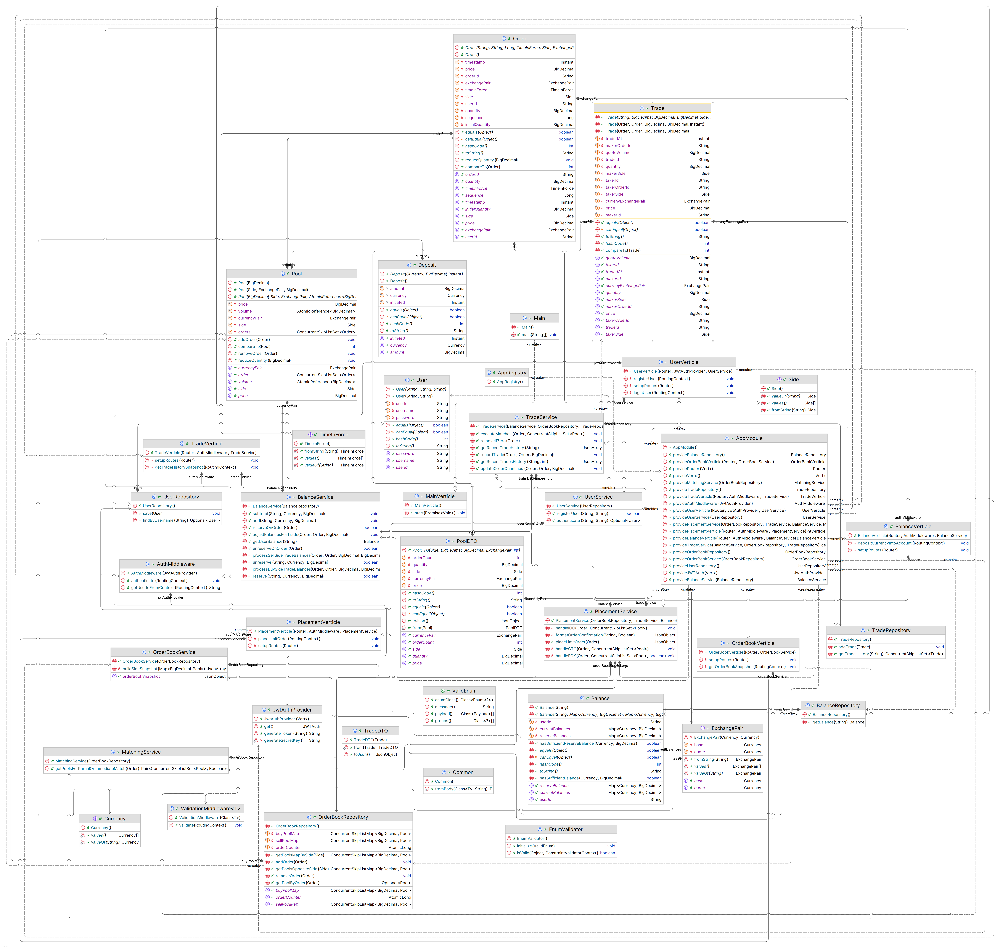

Project: Valr Exchanger API
===========================


--------

Overview
--------

The **Valr Exchanger API** is a Java-based application that provides functionality for handling cryptocurrency trading, user authentication, and balance management. It includes JWT-based authentication, middleware for request validation, and several endpoints for managing orders, trades, and balances — all running entirely **in-memory**.

Features
--------

*   **JWT Authentication** for secure access
*   **Middleware** for Validation and Authentication
*   **Trade and Order Management** for cryptocurrency transactions
*   **Balance Deposit Services** for adding funds

Installation
------------

### Prerequisites

*   **Java 17** or higher
*   **Gradle**

Setup
-----

### 1\. Clone the repository:

    git clone https://github.com/Yashay/valr-exchanger.git
    cd valr-exchanger

Build & Run
-----------

### 2\. Build the project:

    ./gradlew build

### 3\. Run the application:

    ./gradlew run

The API will start at `http://localhost:8080`.

Running Tests
-------------

To run unit tests:

    ./gradlew test

Test logs will display:

*   ✅ **PASSED**
*   ⚠️ **SKIPPED**
*   ❌ **FAILED**

API Endpoints Overview
----------------------

*   **POST /api/users/register** — Register a user
```
curl --location 'http://localhost:8080/api/users/register' \
    --header 'Content-Type: application/json' \
    --data '{
      "username": "user123",
      "password": "password123"
}'
```
```
ALL FIELDS ARE REQUIRED
```
*   **POST /api/users/login** — Authenticate a user and return JWT
```
curl --location 'http://localhost:8080/api/users/login' \
--header 'Content-Type: application/json' \
--data '{
  "username": "user123",
  "password": "password123"
}'

```
```
THIS GENERATES A TOKEN COPY TOKEN
ALL FIELDS ARE REQUIRED
```  
* **POST /api/orders/limit** — Place a new order (JWT required)
```
curl --location 'http://localhost:8080/api/orders/limit' \
--header 'Authorization: Bearer <INSERT TOKEN>' \
--header 'Content-Type: application/json' \
--data '{
  "side": "SELL", 
  "exchangePair" : "BTCZAR",
  "price": 1,
  "quantity": 20,
  "timeInForce": "GTC"
}'
```
```
ALL FIELDS ARE REQUIRED
```  
| Attributes   | Value (Options)                             |
|--------------|----------------------------------------------|
| side         | SELL/BUY                                     | 
| timeInForce  | GTC/IOC/FOK                                  |


* **POST /api/balance/deposit** — Deposit into account (JWT required)
```
curl --location 'http://localhost:8080/api/balance/deposit' \
--header 'Authorization: Bearer <INSERT TOKEN>' \
--header 'Content-Type: application/json' \
--data '{
  "currency": "BTC",
  "amount" : 100
}'
```
```
ALL FIELDS ARE REQUIRED
```
* **GET /api/trade/history** — Get recent trades (JWT required)
```
curl --location 'http://localhost:8080/api/trade/history' \
--header 'Authorization: Bearer <INSERT TOKEN>' \
--data ''
```  
* **GET /api/orderbook** — Get snapshot of orders in orderbook
```
curl --location 'http://localhost:8080/api/orderbook'
```

Tech Stack
----------

*   **Java 17**
*   **Gradle** (Build automation)
*   **Vert.x** (Core, Web, JWT, Web Client, Config)
*   **Guice** for dependency injection
*   **Jackson** for JSON handling
*   **Jakarta Validation** & **Hibernate Validator**
*   **Lombok** for cleaner code
*   **JUnit 5** & **Mockito** for testing

Notes
-----

*   **All data is stored in memory** — no external database is required.
*   Data will reset on server restart.
*   Future versions may include persistent storage options.


Tasks to be done
-------

- [ ] Add meaningful messages on assertions
- [ ] Look into multi-threaded behaviour of the Balance Service
- [ ] Refactor TestHelper
- [ ] Separate out the Model DAO from DTO
- [ ] Investigate whether ValidationMiddleware can be injected via Guice
- [ ] Add tests for Enums methods
- [ ] Add a debug flag to project

Project Structure
-------




License
-------

This project is licensed under the MIT License — feel free to fork, extend, and contribute!